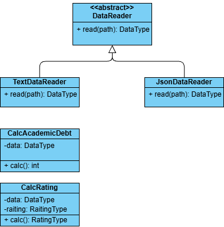

## Цели работы

1. Познакомиться c распределенной системой контроля версий кода Git и ее функциями.
2. Познакомиться с понятиями «непрерывная интеграция» (CI) и «непрерывное развертывание» (CD), определить их место в современной разработке программного обеспечения.
3. Получить навыки разработки ООП-программ и написания модульных тестов к ним на современных языках программирования.
4. Получить навыки работы с системой Git для хранения и управления версиями ПО.
5. Получить навыки управления автоматизированным тестированием программного обеспечения, расположенного в системе Git, с помощью инструмента GitHub Actions.

## Краткое описание проекта

Проект представляет собой консольное приложение на Python для обработки данных об успеваемости студентов. Программа считывает данные из JSON-файла, преобразует их в единую структуру и определяет количество студентов, имеющих академические задолженности — хотя бы одну оценку ниже 61 балла.

Проект построен с использованием принципов объектно-ориентированного программирования и включает модульные тесты для проверки корректности работы компонентов. Для автоматизации тестирования используется GitHub Actions.

## Используемые языки, библиотеки и технологии

- **Python 3.10** — основной язык программирования
- **Pytest** — написание и запуск модульных тестов
- **pycodestyle** — проверка соответствия кода стандарту PEP 8
- **Git** — система контроля версий
- **GitHub** — удалённый репозиторий проекта
- **GitHub Actions** — автоматизация тестирования и проверки кода
- **ООП** — объектно-ориентированный подход к разработке
- **JSON** — формат хранения данных об успеваемости студентов
- **argparse** — обработка аргументов командной строки

## UML-диаграмма

Диаграмма классов проекта представлена ниже.

## Вывод

В ходе лабораторной работы были изучены основные возможности системы контроля версий Git и платформы GitHub. Были получены навыки создания и управления ветками, выполнения коммитов и слияния изменений.

В процессе выполнения работы разработано консольное приложение на Python с использованием принципов объектно-ориентированного программирования. Реализовано чтение данных об успеваемости студентов из JSON-файла и определение количества студентов, имеющих академические задолженности.

Для проверки корректности работы программы были разработаны модульные тесты с использованием библиотеки Pytest. Также настроена автоматическая проверка кода и запуск тестов с помощью GitHub Actions.

Таким образом, были получены практические навыки разработки ООП-приложений, написания модульных тестов, работы с Git и автоматизации тестирования программного обеспечения.